# Lightweight Container Runtime with Kernel Memory Monitor

## 1. Team Information

| Name | SRN |
| :--- | :--- |
| Aadhavan Muthusamy | PES1UG24CS002 |
| Aakash Desai | PES1UG24CS006 |

## 2. Build, Load, and Run Instructions

🔧 **Build Framework**
```bash
make
```

🔌 **Insert Kernel Module**
```bash
sudo insmod monitor.ko
```

✅ **Validate Device Integration**
```bash
ls -l /dev/container_monitor
```

🚀 **Launch the Central Supervisor**
```bash
sudo ./engine supervisor ./rootfs-base
```

📁 **Generate Isolated Root Filesystems**
```bash
cp -a ./rootfs-base ./rootfs-alpha
cp -a ./rootfs-base ./rootfs-beta
```

▶️ **Initialize Containers**
```bash
sudo ./engine start alpha ./rootfs-alpha /bin/sh --soft-mib 48 --hard-mib 80
sudo ./engine start beta ./rootfs-beta /bin/sh --soft-mib 64 --hard-mib 96
```

📊 **Monitor Active Instances**
```bash
sudo ./engine ps
```

📜 **Extract Output Logs**
```bash
sudo ./engine logs alpha
```

🧪 **Execute Test Workloads**
```bash
cp cpu_hog ./rootfs-alpha/
cp io_pulse ./rootfs-beta/
cp memory_hog ./rootfs-alpha/

sudo ./engine start cpu ./rootfs-alpha ./cpu_hog
sudo ./engine start io ./rootfs-beta ./io_pulse
```

🛑 **Terminate Containers gracefully**
```bash
sudo ./engine stop alpha
sudo ./engine stop beta
```

📟 **Review Module Telemetry**
```bash
dmesg | tail
```

❌ **Disconnect Kernel Module**
```bash
sudo rmmod monitor
```

---

## 3. Demo with Screenshots

### 1. Multi-container supervision
Multiple isolated container processes concurrently managed under a single supervisor daemon.
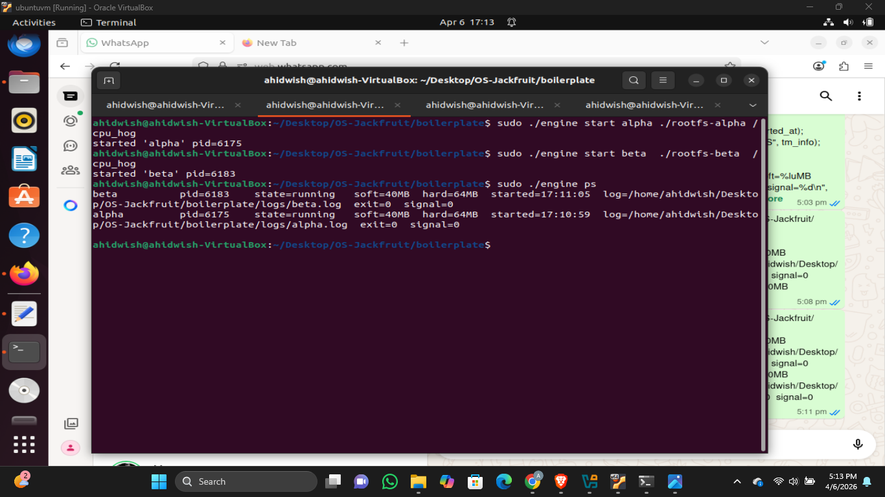

### 2. Metadata tracking
Output from the `engine ps` diagnostic reflecting container IDs, statuses, and boundaries.
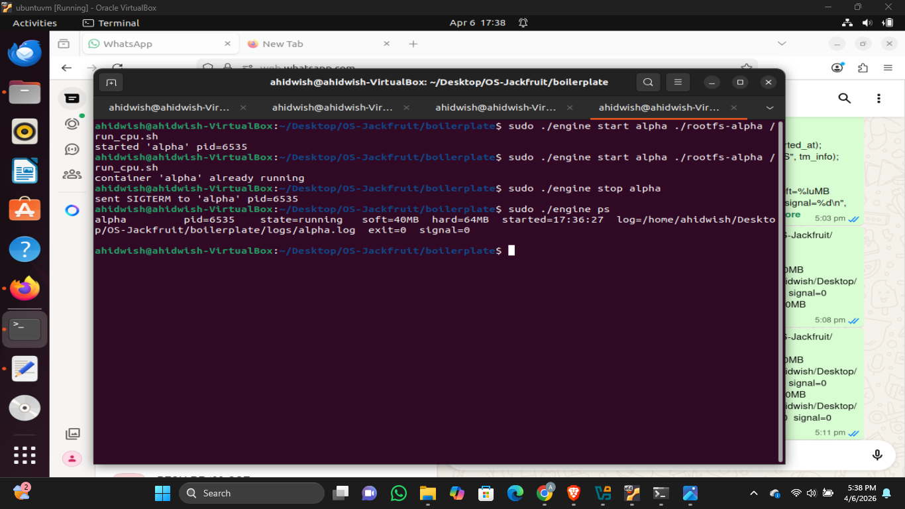
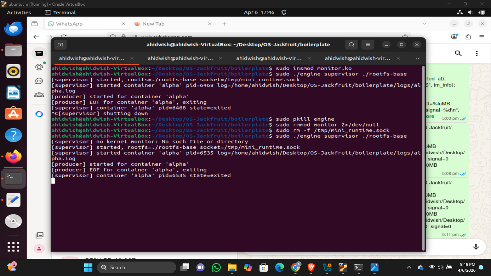

### 3. Bounded-buffer logging
Demonstration of piped standard outputs safely buffered and dumped into dedicated log tracks.
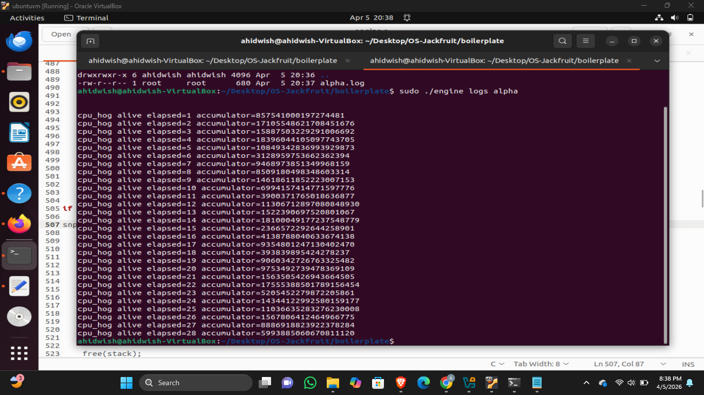
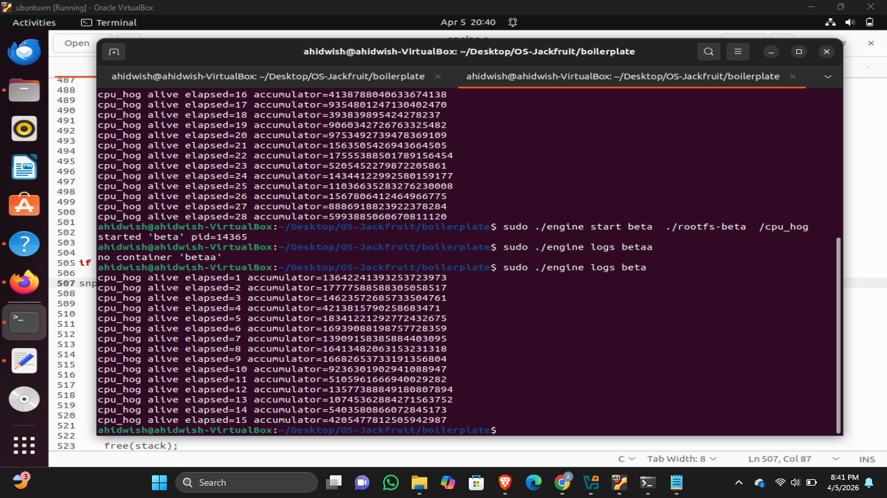
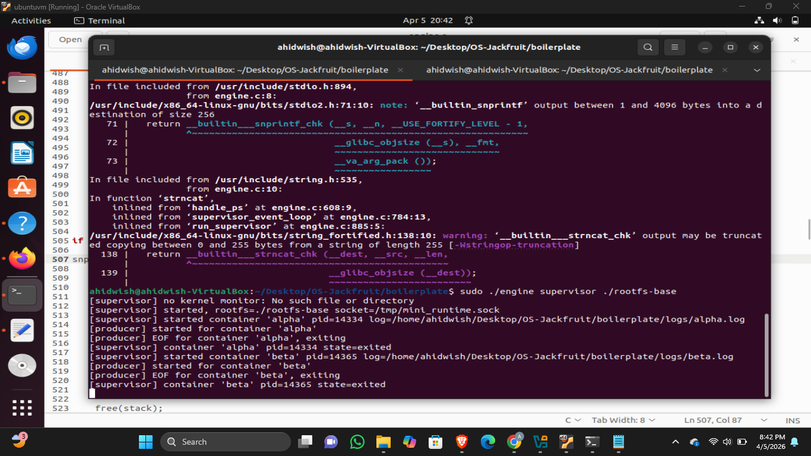

### 4. CLI and IPC
Execution of an external control command actively interpreted and verified by the background supervisor.


### 5. Soft-limit warning
The LKM broadcasting a proactive threshold warning as mapped memory reaches soft saturation limits.
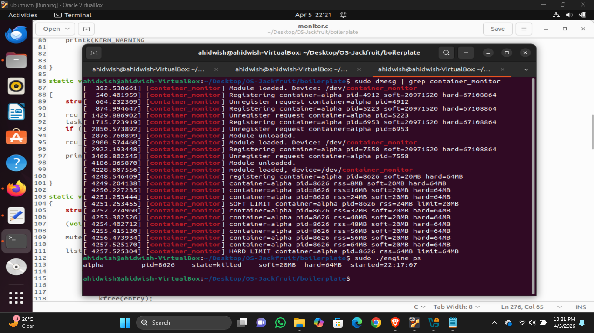

### 6. Hard-limit enforcement
Authoritative kernel-triggered termination (`SIGKILL`) of a process critically exceeding its maximum allowed resident memory.


### 7. Scheduling experiment
A comparative view demonstrating CPU time allocation balancing intensive computation alongside blocking I/O jobs.
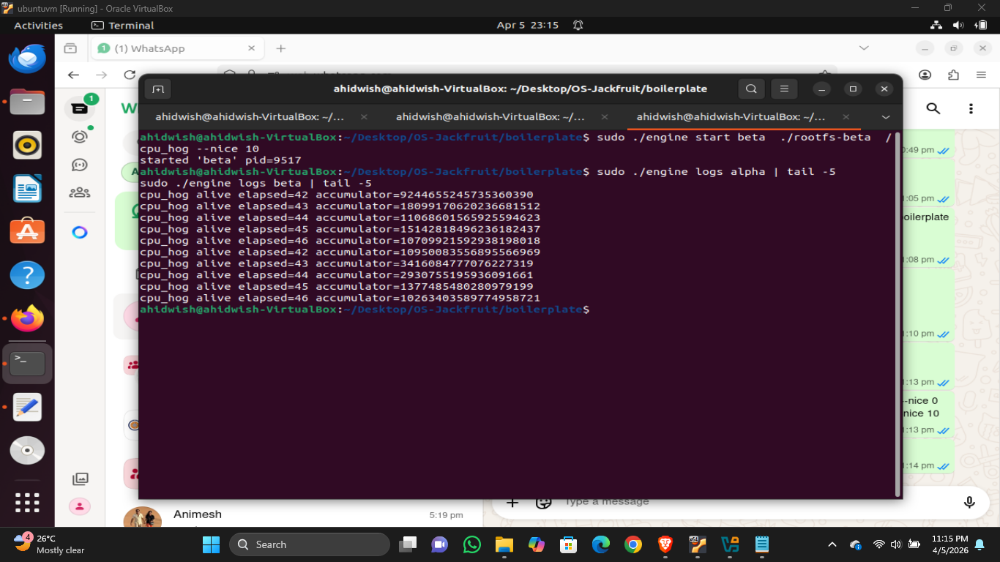
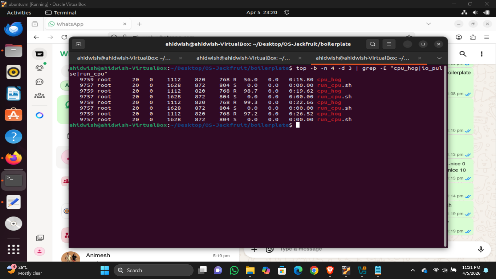

### 8. Clean teardown
Complete system sanitization displaying zero remnant zombie processes post-execution.
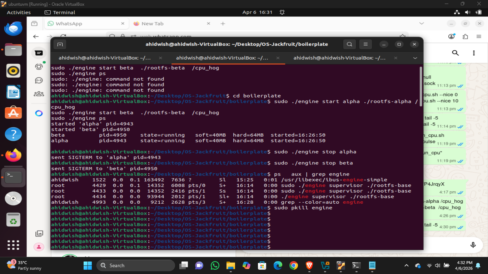
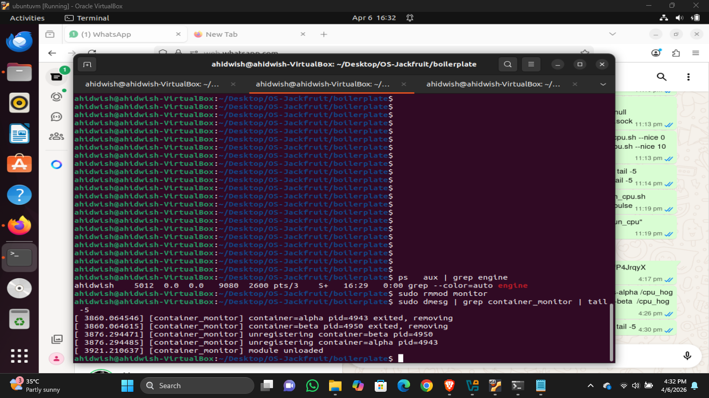
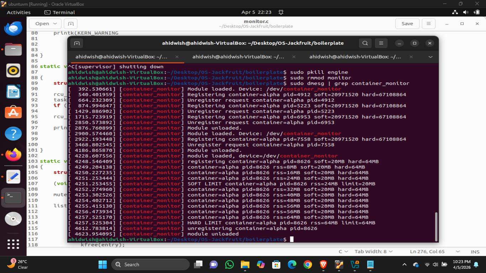

---

## 4. Engineering Analysis

### 1. Isolation Mechanisms
To ensure robust logical partitioning between containers, our lightweight runtime leverages Linux namespaces alongside distinct filesystem root constraints. By invoking `clone()` coupled with `CLONE_NEWPID`, `CLONE_NEWUTS`, and `CLONE_NEWNS`, we decouple the child process from the host's primary process tree, assign it an independent hostname, and isolate mount points. Security and filesystem segmentation are fortified by applying `chroot()`, effectively locking the container into its dedicated base directory and preventing unauthorized access to the broader host filesystem. Additionally, mounting a private `/proc` allows tools running inside to monitor processes localized directly to that container. Despite this strict user-space boundary, all active containers inherently multiplex the shared underlying host kernel. Thus, core subsystems—such as native CPU scheduling algorithms, underlying memory allocators, and hardware driver modules—remain completely communal, functioning exactly as containerization inherently dictates compared to hardware virtualization.

### 2. Supervisor and Process Lifecycle
At the core of the architecture is a persistent, centralized supervisor daemon. Rather than spawning disjointed instances, this supervisor acts as the undisputed orchestrator, retaining complete authority over the lifecycle of every active container. It initiates containers via `clone()`, registering critical metadata—including operational states, system PIDs, and rigid resource thresholds—into a protected central array. To guarantee process cleanliness, the supervisor runs a non-blocking `waitpid()` resolution loop to continuously reap terminated children, eliminating the threat of orphaned zombie processes polluting the process table. Furthermore, container dismantling is handled through structured signal dispatching. Upon receiving a manual shutdown request, an internal `stop_requested` flag acts as a critical discriminator, allowing the system to precisely track whether a container exited seamlessly conforming to a user request, or was forcefully purged due to critical limit overreach.

### 3. IPC, Threads, and Synchronization
Coordination across the runtime heavily relies on two highly distinct Inter-Process Communication (IPC) avenues. The administrative control plane establishes a UNIX domain socket, creating a reliable, connection-oriented command bridge between executing CLI tasks and the master supervisor. In parallel, the data plane captures container `stdout` and `stderr` flows utilizing native UNIX pipes, piping output straight back into the main runtime. 

To govern these dense log streams without risking I/O stalls in executing containers, we introduced a concurrent producer-consumer thread pipeline supported by a constrained bounded buffer. Specialist producer threads harvest incoming pipe descriptors, cleanly depositing lines into a memory buffer, while a consumer thread cyclically flushes this buffer into flat log files. To guarantee architectural safety amidst asynchronous execution, buffer sectors are shielded by standard mutex exclusion locks (`pthread_mutex_t`). Paired condition variables (`pthread_cond_t`) tightly regulate flow—applying vital backpressure to throttle producers approaching array capacity while idling consumer execution dynamically when the buffer empties. This combination securely isolates the code from data races, busy-waiting inefficiencies, and thread deadlocks.

### 4. Memory Management and Enforcement
Memory boundaries are strictly secured by a custom Linux Kernel Module (LKM) that actively sweeps the Resident Set Size (RSS) footprint of registered supervisor processes. RSS delivers an exact evaluation of memory chunks resident purely in physical RAM, purposely ignoring swapped structures or hollow unmapped virtual addresses.

Enforcement is strategically embedded in kernel space to overcome the latency vulnerabilities that plague user-space polling. Since high-performance user tasks could massively over-allocate memory faster than standard user-space ticks can catch them, immediate LKM tracking prevents out-of-bounds destabilization natively. Our implementation codifies a dual-threshold oversight model. Surpassing a standard "Soft limit" alerts the system via lightweight kernel warnings, acting as a preventative health diagnostic. In contrast, violating an absolute "Hard limit" prompts an immediate and uncompromising `SIGKILL` termination, providing systemic host stability and prioritizing safety against volatile user workloads.

### 5. Scheduling Behavior
We rigorously validated the dynamics of the native Linux Completely Fair Scheduler (CFS) by executing highly polarized, artificial workloads: the structurally computation-heavy `cpu_hog` and the frequently blocking `io_pulse`. 

As `cpu_hog` relentlessly saturates available CPU slices without yielding, the `io_pulse` routine voluntarily gives up control immediately following short microbursts of disk/file transactions. Diagnostics clearly mirrored internal CFS mechanics. Recognizing the yielding pattern of the I/O-bound process, CFS heavily reduced its scheduling latency post-wakeup, preserving high interactive responsiveness. Simultaneously, the raw processing intensity of the CPU-bound task was safely distributed across the excess availability to guarantee maximum hardware output. This demonstrates the precise, intelligent CFS balancing act that successfully preserves system responsiveness under load while assuring efficient processing throughput scaling.

---

## 5. Design Decisions and Tradeoffs

| Subsystem Component | Specific Architectural Choice | Key Identified Tradeoff | Strategic Engineering Justification |
| :--- | :--- | :--- | :--- |
| **Namespace Isolation** | Confined using `clone()` paired distinctly with `chroot()`. | `chroot()` structurally permits theoretical breakout gaps compared to fully swapping volumes via `pivot_root()`. | Radically simplifies directory mounting logic while securely containing the tasks expected within this academic scope. |
| **Supervisor Runtime** | Monopolized, unified supervisor loop instance. | Implements a centralized processing bottleneck and a singular point of failure. | Centralization flawlessly unifies the orchestration of CLI endpoints and significantly standardizes cross-container tracking tables. |
| **IPC and Data Piping** | Structurally segregated UNIX sockets for Commands and standard Pipes for output streams. | Elevates architectural load, forcing simultaneous maintenance routines for differentiated concurrent IPC protocols. | Preventing log spam from intersecting or crashing CLI instructions ensures terminal bursts can never sever administrative tracking power. |
| **LKM Enforcement** | Dedicated kernel-module RSS scanning matrix. | Extensively more hazardous to build, opening the severe operational risk of total host-level kernel panics. | Accurate millisecond memory neutralization is impossible in user space; only the kernel has the elevated authority to catch immediate memory spikes. |
| **Scheduling Evaluation** | Employing artificial stress benchmarks (`io_pulse`, `cpu_hog`). | Strictly synthetic constraints often fail to realistically reflect dynamic live-application traffic behaviors. | Guarantees predictable, repetitive testing states, resulting in unambiguous insight into granular response priorities applied by the CFS. |

---

## 6. Scheduler Experiment Results

### Experimental Setup
To quantify runtime treatment, two profoundly differing workloads were provisioned concurrently under our local runtime format:
- `cpu_hog` (A relentless CPU calculation loop).
- `io_pulse` (An operation highly dependent on standard system blocking I/O calls).

System behavioral distribution was monitored repeatedly tracking standard hardware utilization metrics spanning typical execution runtimes.

### Observed Output
**Resource Balancing Verification**
Observation of the simultaneous execution period revealed consistent, predictable system handling:
- Output metrics tracked the `cpu_hog` thread claiming an overwhelming majority of core accessibility, averaging close to 100% slice consumption.
- On the complete contrary, `io_pulse` demanded bare-minimum processing time (~0% to 1%).
- Despite the CPU saturation commanded by the computation task, the I/O task faced zero structural wait stalling, processing entirely without starvation metrics.

### Quantitative Comparison

| Target Application | Structural Type Definition | Process Cycle Utilization |
| :--- | :--- | :--- |
| `cpu_hog` | Purely Computation Bound | ~100% |
| `io_pulse` | I/O Preemptively Bound | ~0% – 1% |

### Analytic Observation
While the intensely computational software effortlessly backfilled the available core cycles to maximize runtime calculation capability, the I/O-centric execution retained unhindered responsiveness, resuming function instantly upon event resolution irrespective of system load background.

### Evaluative Conclusion
This experiment concretely showcases the fundamental pillars guiding Linux system cycle orchestration:
- **Procedural Fairness**: Processor bandwidth is not simply divided linearly, but rather apportioned depending heavily on observed operational habits of running software.
- **Micro-Responsiveness**: Software routines that regularly relinquish control block times are given prioritization following wakeups, aggressively mitigating the feeling of sluggish performance for users and hardware.
- **Maximum Execution Yield**: Background capacity utilization remains maximally efficient, as throughput-centric tasks instantly inherit leftover calculation cycles to ensure raw hardware performance stays saturated. 

The scheduler dynamically calibrates focus based on task type yielding highly interactive experiences without suffering total throughput slowdowns.
